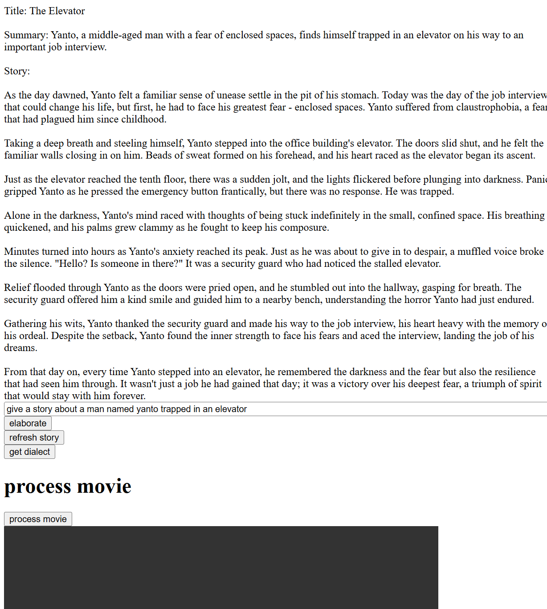
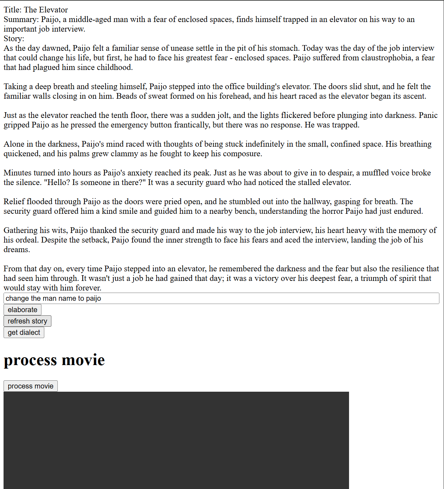
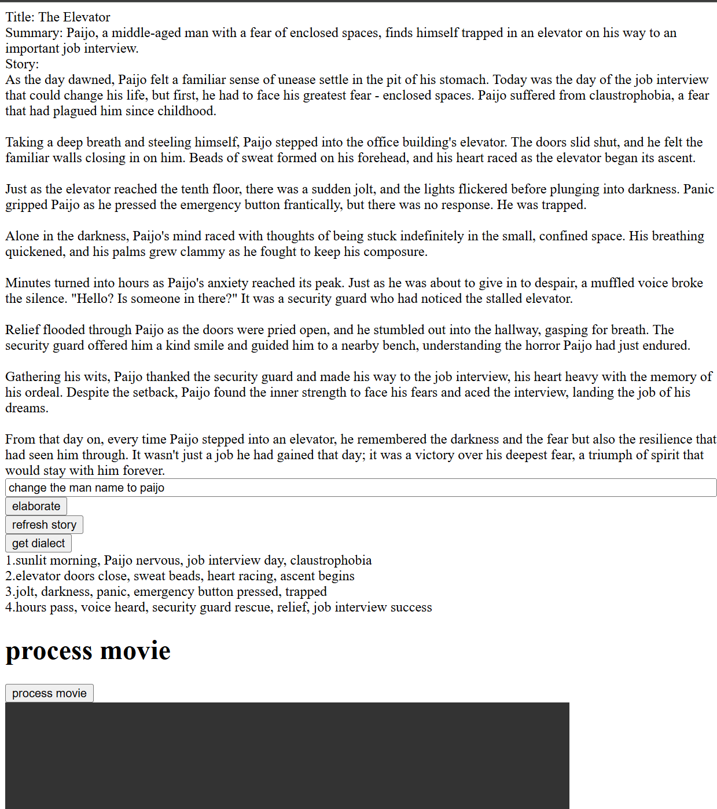
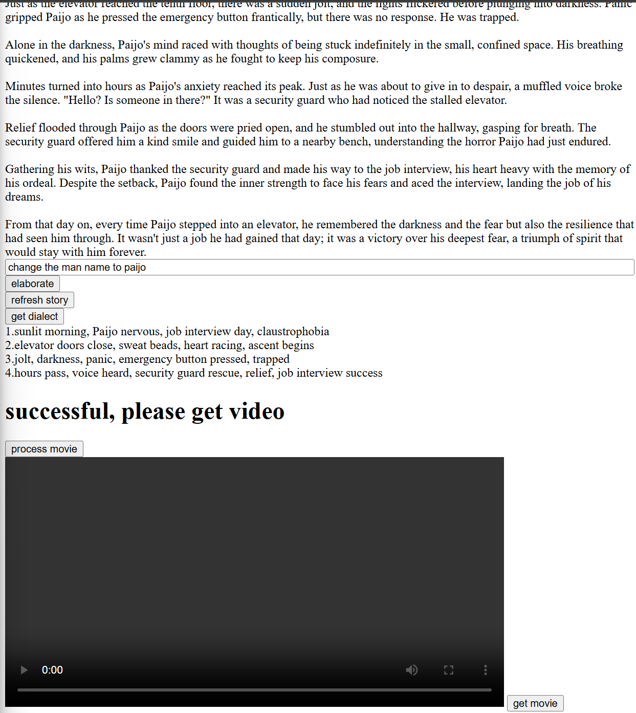
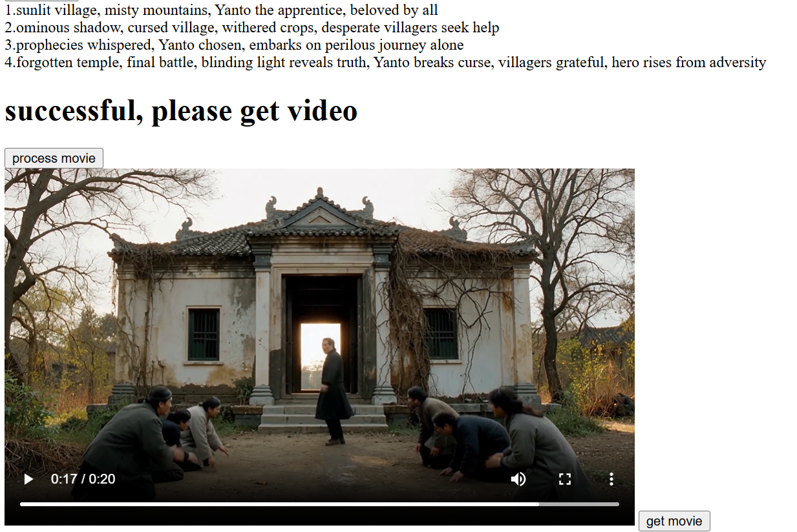

# AI API based text to movie generator

This project is a Node.js express server based appplication that uses API from OpenAI 
and Replicate. Additionally, it uses a python file for ffmpeg in order to process mp4 and mp3 files.

OpenAI API mainly offers LLM AI based API, with the addition of features such as vision, audio and image generation. for more information check: https://platform.openai.com/docs/introduction

On the other hand, Replicate offers multiple AI that is run on their infrastructure. for more information, check: https://replicate.com/docs

## Aim
The Aim of this application is mainly to use simple text prompt to generate videos in order to upload it on short clips sites such as TikTok and YouTube. This application can also later be used as a pipeline for automation apps such as zapier, to be able to automatically create a short clip bot for monetization purposes.

## Dependencies:
npm install axios body-parser cors dotenv express openai replicate  
npm install --save-dev nodemon  
pip install moviepy==1.0.3  

Additionally, before proceeding, please create a ".env" file inside the server folder and fill it out with your API key: 
REPLICATE_API_TOKEN = ...  
OPENAI_API_KEY = ...  

## Route flow:
1)generate-story: Text Prompt -> OPENAI API -> story  
2)rechange-story: Text Prompt + story -> OPENAI API -> story  
3)get-dialect:    story -> OPEN AI API -> dialect  
4)process-movie:    dialect -> Replicate AI API -> video clips  
5)get-movie:    video clips -> Stream to -> client  

## Demo:
## 1. Elaborate Story

use elaborate story in order to create a new story

1. Enter **story prompt** in the input field.  
2. Click **elaborate** button.  
3. This will trigger generate-story route in the server
4. response will be displayed inside the **response** div above the input field. 

---

## 2. Rechange Story

use rechange story to change the current story if it doesnt fit well

1. Change the prompt in the input field  
2. Click the **refresh story** button.  
3. This will trigger rechange-story route in the server
4. response will be displayed inside the **response** div above the input field. 

---

## 3. Get Dialect

use get dialect in order to get the dialect scenes for the video generation prompt

1. Click the **get dialect**  button.  
2. This will trigger get dialect route in the server 
3. response will be a cleaned-up series of lines (1., 2., 3., …) displayed in the **dialect** div below the input field.  

---

## 4. Process Movie

Convert each dialect line by line into AI-generated video and audio clips, then combine them.

1. Click the **Process Movies** button.  
2. This will trigger get process-movie route in the server  
3. this will show "processing" text
4. Backend modules workflow:  
   - **cleanDialect** splits lines and removes numeric prefixes.  
   - **textToVideoGeneration** uses Replicate to generate .mp4 and .mp3 files.  
   - **combineMovie** merges clips into finalMovie.mp4 via ffmpeg.  
4. "processing" text changes to "successful, please get video" when done

---

## 5. Get Movies

Finally, stream the generated movie from the server.

1. Click the **get movie** button.  
2. The browser will stream the generated movie 

## future updates:
- Better error handling as some errors are not handled/ logged properly
- Make the program, such as the callbacks follow a more modern coding conventions
- Remove repeated codes as repeated codes at interactions.js are present
- the prompt for the videos are generated with the same prompt for the text to speech prompt coming from the dialect. the videos generated might not be accurate. further updates can put another function to take the prompt and elaborate it further using another chatgpt API into a more descriptive prompt, before finally feeding it to the video generation API
- Interface update to make it more alluring
- add an options parameter to the interface in order to tune the API configuration.

